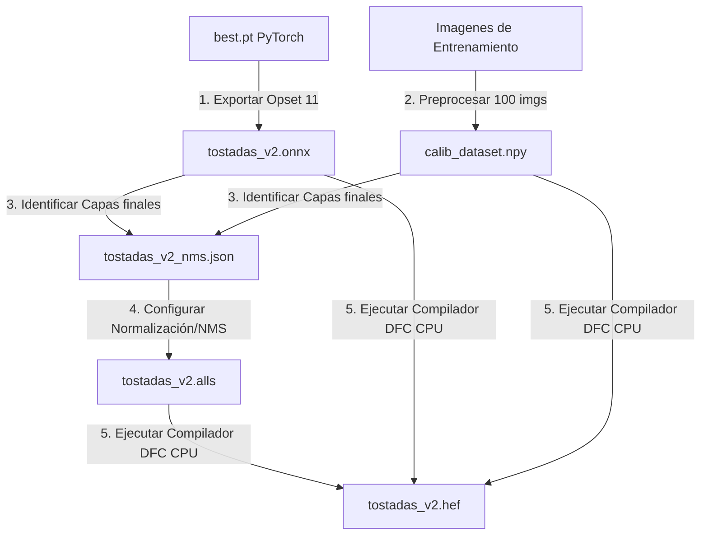

# Guía de Migración y Compilación de Modelos YOLO a Hailo (HEF)

Esta guía explica detalladamente cómo migrar y compilar modelos entrenados en PyTorch (`.pt` de YOLOv8/v11) al formato ejecutable de Hailo (**HEF**) utilizando esta computadora (Windows con WSL2).

---

## 1. Requisitos Previos (Entorno de Software)

El compilador de Hailo (Dataflow Compiler - DFC) requiere un sistema operativo Linux y una versión específica de Python. Lo ejecutamos dentro de **WSL2 (Ubuntu)** con las siguientes configuraciones previas:

### A. Entorno de WSL2
* **WSL2 instalado** con la distribución Ubuntu.
* **Python 3.10:** Instalado mediante el repositorio PPA deadsnakes (ya que versiones más nuevas como Python 3.12 o 3.14 tienen conflictos con librerías requeridas como SciPy 1.12).
* **Entorno Virtual:** Creado en la ruta de WSL `~/hailo_env_3.10` para aislar las librerías.
* **Variable Temporal para Pip:** WSL2 limita la memoria de `/tmp` a 3.9 GB. Para evitar errores de falta de espacio (`No space left on device`) al descargar TensorFlow o PyTorch, se crea una carpeta física `~/pip_tmp` en el disco principal y se antepone la variable `TMPDIR=~/pip_tmp` al instalar paquetes.

### B. Paquetes instalados en Linux (WSL)
* **Hailo Dataflow Compiler (DFC) v3.34.0:** Instalado a partir del archivo `.whl` descargado en Windows:
  ```bash
  TMPDIR=~/pip_tmp ~/hailo_env_3.10/bin/pip install --no-cache-dir /mnt/c/Users/angel/Downloads/hailo_dataflow_compiler-3.34.0-py3-none-linux_x86_64.whl
  ```
* **Ultralytics & ONNX Tools:** Para re-exportar y simplificar modelos en Linux sin límites de longitud de archivos de Windows:
  ```bash
  ~/hailo_env_3.10/bin/pip install ultralytics
  # Downgrade de numpy a 1.26.4 requerido por Hailo Compiler:
  ~/hailo_env_3.10/bin/pip install numpy==1.26.4
  ```

---

## 2. El Proceso de Migración Paso a Paso

El proceso para convertir el modelo entrenado `best.pt` al archivo `tostadas_v2.hef` consta de 6 pasos fundamentales:



### Paso 1: Generar el Dataset de Calibración
El compilador de Hailo requiere un conjunto de imágenes reales representativas (de 50 a 100 imágenes) para realizar la cuantización a 8 bits (INT8) sin perder precisión.
* **Script:** `ai_training/scripts/prepare_calibration.py`
* **Acción:** Lee 100 imágenes del dataset Roboflow de tostadas, las redimensiona a RGB `640x640` y las une en una matriz de NumPy guardada en `ai_training/models/calib_dataset.npy`.
* **Ventaja:** Al exportar este archivo único de 117 MB, evitamos tener que copiar miles de imágenes individuales entre máquinas o entornos.

### Paso 2: Exportar el modelo PyTorch a ONNX Opset 11
Para que el compilador de Hailo no falle, el modelo ONNX debe exportarse usando el estándar matemático **opset 11** y simplificar su grafo.
* **Comando ejecutado en WSL:**
  ```bash
  ~/hailo_env_3.10/bin/python3 -c "from ultralytics import YOLO; model = YOLO('ai_training/runs/detect/train/weights/best.pt'); path = model.export(format='onnx', opset=11, simplify=True); import shutil; shutil.copy(path, 'ai_training/models/tostadas_v2.onnx')"
  ```
* **Por qué:** Por defecto, las versiones modernas de YOLO exportan en opset 17/19. Esto genera capas de post-procesamiento (`Concat`, `Sigmoid`) complejas que no caben físicamente en los bloques de la NPU Hailo-8L, causando el error de asignación `No valid partition found`. Opset 11 y el simplificador aplanan el grafo.

### Paso 3: Identificar los Nodos de Convolución Finales
Para compilar con éxito, "recortamos" el modelo justo en las 6 capas convolucionales de predicción del cabezal de detección (3 para posicionar cajas y 3 para clasificar clases). 
Inspeccionando el ONNX, identificamos que para YOLOv11/v8 los nombres de los nodos de salida son:
* **Cajas (Regression):**
  * `/model.23/cv2.0/cv2.0.2/Conv`
  * `/model.23/cv2.1/cv2.1.2/Conv`
  * `/model.23/cv2.2/cv2.2.2/Conv`
* **Clases (Classification):**
  * `/model.23/cv3.0/cv3.0.2/Conv`
  * `/model.23/cv3.1/cv3.1.2/Conv`
  * `/model.23/cv3.2/cv3.2.2/Conv`

### Paso 4: Crear la Configuración NMS (`tostadas_v2_nms.json`)
Creamos un archivo JSON que le dice al runtime de Hailo cómo decodificar esas 6 salidas crudas.
* **Archivo:** `ai_training/models/tostadas_v2_nms.json`
* **Contenido Clave:**
  ```json
  {
    "nms_scores_th": 0.001,
    "nms_iou_th": 0.7,
    "max_proposals_per_class": 100,
    "classes": 2,
    "background_class": false,
    "reg_layer": [
      "/model.23/cv2.0/cv2.0.2/Conv",
      "/model.23/cv2.1/cv2.1.2/Conv",
      "/model.23/cv2.2/cv2.2.2/Conv"
    ],
    "cls_layer": [
      "/model.23/cv3.0/cv3.0.2/Conv",
      "/model.23/cv3.1/cv3.1.2/Conv",
      "/model.23/cv3.2/cv3.2.2/Conv"
    ],
    "image_dims": [640, 640]
  }
  ```

### Paso 5: Escribir el Model Script (`tostadas_v2.alls`)
El archivo `.alls` contiene las directivas que se inyectan en el compilador:
* **Archivo:** `ai_training/models/tostadas_v2.alls`
* **Contenido:**
  ```text
  normalization1 = normalization([0.0, 0.0, 0.0], [255.0, 255.0, 255.0])
  nms_postprocess("/mnt/c/Users/angel/OneDrive/Desktop/tesis/raspberry_front_back_smart-check/ai_training/models/tostadas_v2_nms.json", meta_arch=yolov8, engine=cpu)
  ```
  Esto aplica la normalización de píxeles correcta y adjunta la capa NMS final al archivo HEF para que la salida coincida con la que espera la aplicación PySide6.

### Paso 6: Compilar usando el Script Automatizado
* **Archivo:** `ai_training/scripts/compile_hailo.py`
* **Comando para ejecutar (CPU):**
  ```bash
  wsl CUDA_VISIBLE_DEVICES="" ~/hailo_env_3.10/bin/python3 /mnt/c/Users/angel/OneDrive/Desktop/tesis/raspberry_front_back_smart-check/ai_training/scripts/compile_hailo.py
  ```
  * **Por qué `CUDA_VISIBLE_DEVICES=""`:** Desactiva la GPU NVIDIA para TensorFlow dentro de WSL. TensorFlow JIT (XLA) suele fallar si no encuentra las rutas exactas de CUDA instaladas en Linux. Al forzar la CPU, la cuantización e inferencia se ejecutan con total estabilidad usando la CPU principal.

---

## 3. Integración en el Backend y Pruebas

El archivo del backend `backend/infrastructure/ai/yolo_detector.py` incluye una lógica de detección dinámica:

1. **Auto-Detección:** Si la aplicación detecta que la librería `hailo_platform` está disponible (NPU activa) y el archivo `tostadas_v2.hef` existe en la carpeta `models`, cargará el modelo acelerado por hardware de forma transparente.
2. **Fallback Gradual:** Si la librería no está instalada (por ejemplo, en tu entorno de desarrollo en Windows), la aplicación cargará de manera automática el archivo `tostadas_v2.onnx` en la CPU con OpenCV DNN.

Puedes verificar el fallback de la CPU ejecutando en Windows:
```bash
python test_inference.py
```
Esto creará una imagen de salida con las cajas pintadas en `multimedia/output/test_result_inference.jpg`.

---

## 4. Archivos Clave Creados en el Repositorio

### A. Archivos Esenciales para Producción e Inferencia
* **`ai_training/models/tostadas_v2.hef`**: Modelo ejecutable binario en la NPU Hailo-8L de la Raspberry Pi. Es el único necesario en la NPU.
* **`ai_training/models/tostadas_v2.onnx`**: Modelo de fallback en CPU (Opset 11) utilizado para pruebas locales en Windows/PC.

### B. Archivos de Desarrollo y Re-compilación
* **`ai_training/models/tostadas_v2_nms.json`**: Mapeo de las 6 capas de salida del modelo y número de clases (2) para el post-procesamiento.
* **`ai_training/models/tostadas_v2.alls`**: Script con directivas de normalización y NMS para el compilador.
* **`ai_training/models/calib_dataset.npy`**: Dataset de calibración procesado con 100 imágenes.
* **`ai_training/scripts/compile_hailo.py`**: Script de automatización de compilación.
* **`ai_training/scripts/prepare_calibration.py`**: Script de preparación de calibración.

### C. Archivos Intermedios HAR (Seguros de Eliminar)
Los archivos `.har` (**Hailo Archive**) son los puntos de control intermedios que usa el compilador a lo largo de las distintas etapas:
* **`tostadas_v2.har`**: Grafo del modelo ONNX traducido al lenguaje interno de Hailo (en precisión flotante FP32).
* **`tostadas_v2_quantized.har`**: Modelo tras aplicar la calibración y optimización para comprimir los pesos a 8 bits (INT8).
* **`tostadas_v2_compiled.har`**: Modelo con la disposición física mapeada en los núcleos del chip NPU antes de empaquetarse en el HEF final.

### D. Archivos de Registro y Logs (Seguros de Eliminar)
* Archivos como `hailo_sdk.client.log`, `hailo_sdk.core.*.log`, `acceleras.log` y `allocator.log` son reportes de diagnóstico generados automáticamente por el compilador para rastrear el proceso de ruteo físico de capas. Se pueden borrar de la raíz y de la carpeta `models` sin alterar el funcionamiento del modelo.

